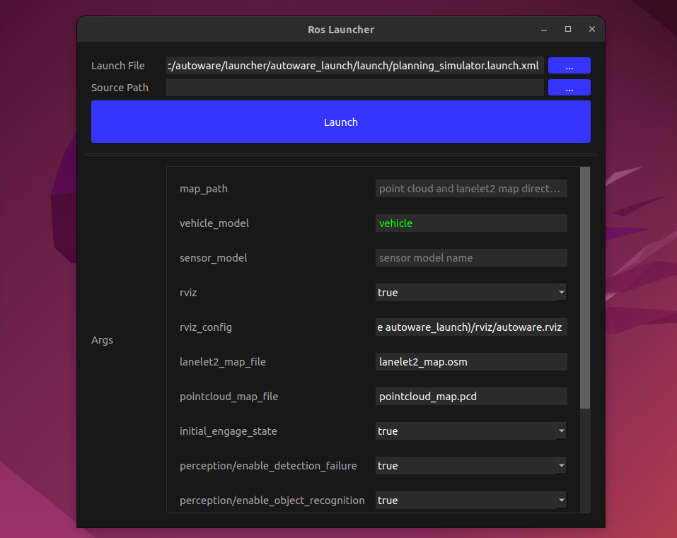

# ROS Launcher

GUI launcher for ROS2.



## Install and Setup

Run setup scripts.

```
cd ~/ros_launcher
./setup.sh
```

## Usage

Double-click the launch file(.xml) file to launch the application.

---

2022.12 yudai.yamazaki